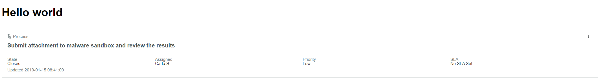

@tkj/hello-world
===============================================

When running this component locally it works fine as expected.

It should look like this:

Have tested on a PDI Orlando patch1 and a non-prod instanse Oralando patch3 with the same result.

When deployed to a ServiceNow instance and added as a sidepanel component it does not render and following error message is listed in the cosnole log:

An unknown loading error occurred in /uxjs/@tkj/hello-world.jsdbx
ReferenceError: __TECTONIC__$servicenow_now_template_card is not defined
    at Object.<anonymous> (/uxfc/component/18892b8e8d9e35961cd381c1247d0254.jsdbx?sysparm_substitute=false:6)
    at n (/uxfc/component/18892b8e8d9e35961cd381c1247d0254.jsdbx?sysparm_substitute=false:6)
    at Object.<anonymous> (/uxfc/component/18892b8e8d9e35961cd381c1247d0254.jsdbx?sysparm_substitute=false:6)
    at n (/uxfc/component/18892b8e8d9e35961cd381c1247d0254.jsdbx?sysparm_substitute=false:6)
    at Object.<anonymous> (/uxfc/component/18892b8e8d9e35961cd381c1247d0254.jsdbx?sysparm_substitute=false:6)
    at n (/uxfc/component/18892b8e8d9e35961cd381c1247d0254.jsdbx?sysparm_substitute=false:6)
    at Object.<anonymous> (/uxfc/component/18892b8e8d9e35961cd381c1247d0254.jsdbx?sysparm_substitute=false:6)
    at n (/uxfc/component/18892b8e8d9e35961cd381c1247d0254.jsdbx?sysparm_substitute=false:6)
    at /uxfc/component/18892b8e8d9e35961cd381c1247d0254.jsdbx?sysparm_substitute=false:6
    at /uxfc/component/18892b8e8d9e35961cd381c1247d0254.jsdbx?sysparm_substitute=false:6
